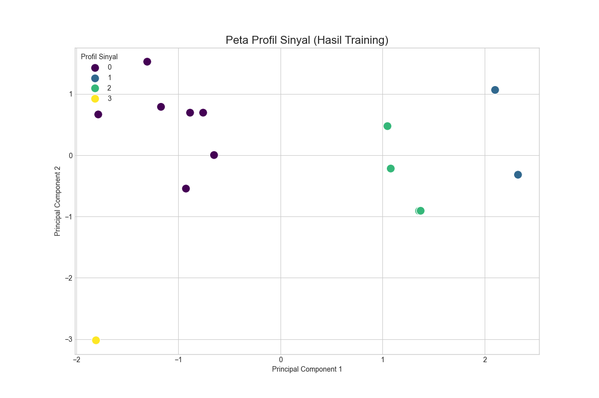

# Proyek: Deteksi Anomali Spektrum RF Cerdas

Proyek ini bertujuan untuk membangun sebuah sistem machine learning (pembelajaran mesin) tanpa pengawasan (*unsupervised*) untuk menganalisis data spektrum frekuensi radio (RF) dan secara otomatis mendeteksi anomali. Sistem ini belajar dari data pengukuran historis untuk membuat "profil sinyal" normal dan kemudian menggunakannya untuk menilai sinyal baru.

## Struktur Proyek

- **/data**: Berisi data pengukuran RF.
    - `/raw`: Data mentah hasil pengukuran dari SDR (Software-Defined Radio).
    - `/processed`: Data yang telah diproses dan siap digunakan untuk training (misalnya, matriks fitur).
- **/notebooks**: Serangkaian Jupyter Notebook yang menjelaskan alur kerja dari persiapan data hingga deteksi anomali.
- **/models**: Tempat penyimpanan model-model machine learning yang telah dilatih (`scaler`, `pca`, `kmeans`).
- **/assets**: Menyimpan file pendukung seperti gambar dan plot yang dihasilkan, untuk digunakan dalam dokumentasi.

---

## Alur Kerja Analisis

Proses analisis dibagi menjadi empat tahap utama, yang masing-masing diimplementasikan dalam sebuah notebook.

### 1. `01_Data_Preparation.ipynb` - Persiapan Data

Tahap ini bertanggung jawab untuk mengidentifikasi dan memisahkan file-file data yang akan digunakan.

**Output Utama:**
```
Total file pengukuran ditemukan: 14
Jumlah file untuk training model: 14
Jumlah file untuk simulasi live: 2
```
Dari total 14 file, semuanya dialokasikan untuk melatih model, dan 2 file disisihkan untuk mensimulasikan bagaimana sistem akan menganalisis data "baru" atau "live".

### 2. `02_Feature_Engineering.ipynb` - Rekayasa Fitur

Pada tahap ini, kita mengekstrak fitur-fitur fisis yang relevan dari setiap file pengukuran mentah. Fitur-fitur ini yang akan "dilihat" oleh model machine learning kita.

**Contoh Fitur yang Diekstrak:**
```
                noise_floor_db  num_signals  strongest_signal_power_db  strongest_signal_freq_mhz  strongest_signal_bw_mhz
file                                                                                                                      
1000_anomali_1           -47.6            3                      -13.9                      995.0                     13.6
1000_anomali_2           -47.6            3                      -13.8                      995.0                     12.9
1000_anomali_3           -47.6            5                      -14.5                     1000.0                     13.2
1000_anomali_4           -47.6            4                      -15.1                      995.0                     12.4
1500_anomali_1           -47.6            5                      -20.4                     1495.0                     12.3
```
Fitur-fitur ini mencakup level noise dasar, jumlah sinyal yang terdeteksi, serta kekuatan, frekuensi, dan lebar pita dari sinyal terkuat.

### 3. `03_Model_Training.ipynb` - Pelatihan Model & Analisa Pola

Di sini, kita melatih model menggunakan data fitur. Kombinasi dari **StandardScaler**, **PCA** (untuk visualisasi), dan **K-Means Clustering** digunakan untuk mengelompokkan data ke dalam profil-profil sinyal yang berbeda.

**Peta Profil Sinyal:**
Gambar di bawah ini adalah hasil visualisasi dari PCA, di mana setiap titik mewakili satu file pengukuran dan warnanya menunjukkan cluster atau "profil" yang ditemukan oleh K-Means.



Setelah training, model `scaler`, `pca`, dan `kmeans` disimpan ke direktori `/models` untuk digunakan pada tahap selanjutnya.

### 4. `04_Live_Anomaly_Detection.ipynb` - Simulasi Deteksi Anomali

Notebook terakhir ini mensimulasikan skenario dunia nyata. Model yang sudah terlatih dimuat kembali untuk menganalisis dua file yang sebelumnya kita sisihkan.

**Laporan Deteksi Live:**
```
--- LAPORAN SIMULASI DETEKSI ANOMALI LIVE ---

ANALISIS UNTUK FILE: 1700_anomali_1
  -> Profil Terdeteksi : Profil 0: Sinyal Sangat Kuat di ~1639 MHz (Frekuensi Tidak Dikenal)
  -> Skor Anomali      : 0.73
  -> KESIMPULAN        : CUKUP ANOMALI. Sinyal ini cocok dengan sebuah profil, namun menunjukkan deviasi yang perlu diperhatikan.
----------------------------------------
ANALISIS UNTUK FILE: 1000_anomali_4
  -> Profil Terdeteksi : Profil 2: Sinyal Sangat Kuat di ~996 MHz (Navigasi & Penyiaran (Potensi Interferensi))
  -> Skor Anomali      : 0.22
  -> KESIMPULAN        : NORMAL. Sinyal ini sesuai dengan profil yang sudah ada.
```
Sistem berhasil mengklasifikasikan `1000_anomali_4` sebagai sinyal **normal** karena sangat mirip dengan salah satu profil yang sudah ada (skor anomali rendah). Sebaliknya, `1700_anomali_1` diberi label **cukup anomali** (skor anomali lebih tinggi), menandakan bahwa meskipun cocok dengan sebuah profil, karakteristiknya cukup berbeda untuk memerlukan perhatian lebih lanjut.

---

## Cara Menjalankan

### 1. Instalasi Dependensi

Sebelum menjalankan notebook, instal semua library yang diperlukan menggunakan file `requirements.txt`. Buka terminal Anda dan jalankan perintah berikut:

```bash
pip install -r requirements.txt
```

### 2. Menjalankan Notebook

Setelah instalasi selesai, jalankan Jupyter Notebook di dalam folder `/notebooks` secara berurutan:
1.  `01_Data_Preparation.ipynb`
2.  `02_Feature_Engineering.ipynb`
3.  `03_Model_Training.ipynb`
4.  `04_Live_Anomaly_Detection.ipynb`
